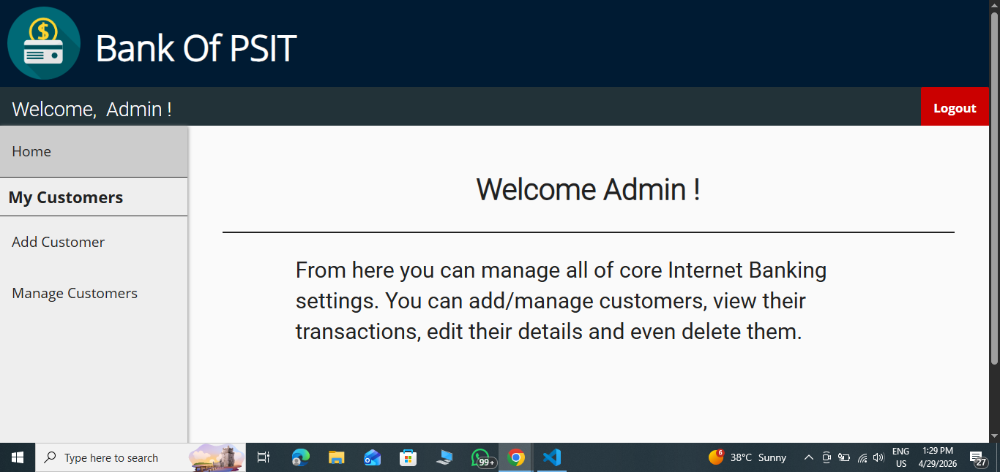

# 💳 E-Banking Web Application

A secure and user-friendly web-based banking system that allows users to manage accounts, transfer funds, and view transaction history efficiently.

---

## 🚀 Features

* 🔐 User Authentication (Login / Signup)
* 💸 Fund Transfer System
* 📊 Transaction History
* 👤 User Dashboard
* 🛡 Secure Data Handling

---

## 🛠 Tech Stack

* **Frontend:** HTML, CSS, JavaScript
* **Backend:** PHP
* **Database:** MySQL (phpMyAdmin)

---

## 📸 Screenshots

<!-- Add your screenshots like this -->

## 🧑‍💼 Admin Dashboard


---

## ⚙️ Installation & Setup

1. Clone the repository:

   ```bash
   git clone https://github.com/prateekdixit470/E-banking-web-app.git
   ```

2. Move project to XAMPP htdocs folder:

   ```bash
   C:\xampp\htdocs\
   ```

3. Start XAMPP:

   * Apache ✅
   * MySQL ✅

4. Import database:

   * Open http://localhost/phpmyadmin
   * Create database
   * Import `.sql` file

5. Run the project:

   ```bash
   http://localhost/E-banking-web-app/
   ```

---

## 🔒 Security Features

* Input validation
* Basic authentication system
* Structured database handling

---

## 📌 Future Improvements

* Password hashing (bcrypt)
* OTP/email verification
* Admin panel enhancement
* UI/UX improvements

---

## 👨‍💻 Author

**Prateek Dixit**
GitHub: https://github.com/prateekdixit470

---

## ⭐ Show Your Support

If you like this project, give it a ⭐ on GitHub!
